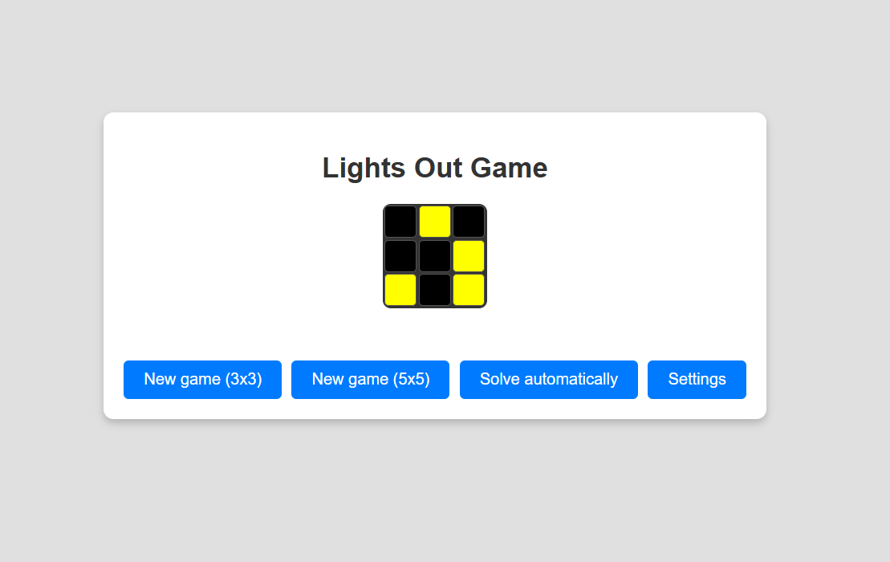
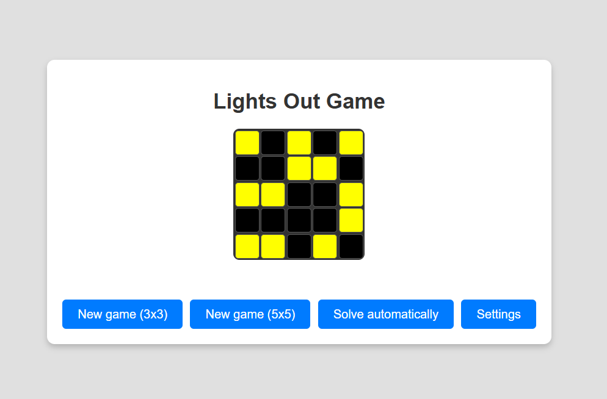
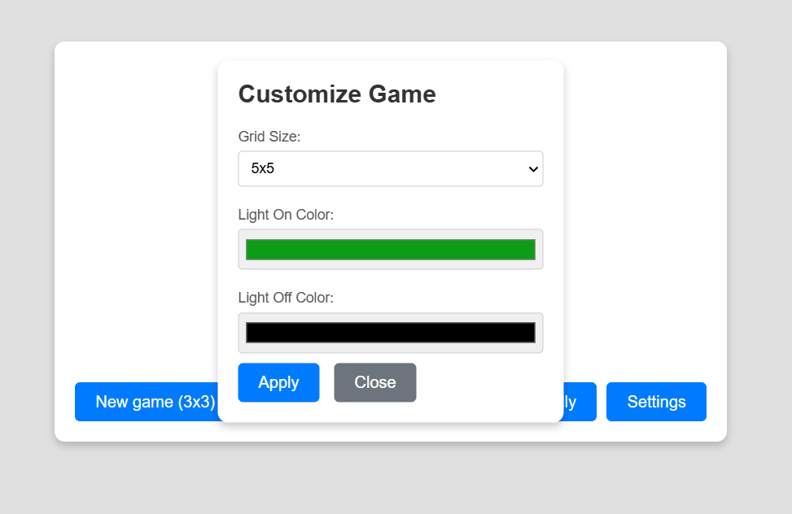
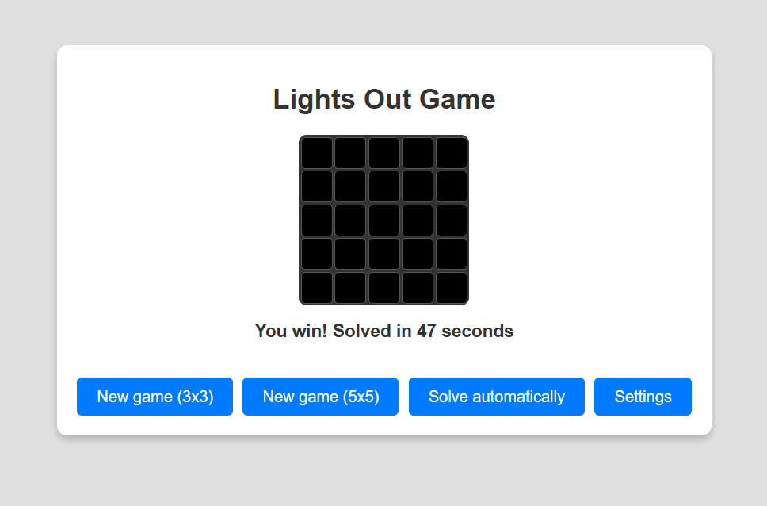

# Lights Out Game

Lights Out is a classic puzzle game where the objective is to turn off all the lights on a grid. Each click toggles a light and its adjacent neighbors. The game is won when all lights are turned off.

- **5x5**

- **Settings**

- **Solved**

## Features

- **Grid Sizes**: Play on a 3x3 or 5x5 grid.
- **Customization**:
  - Choose your own colors for "Light On" and "Light Off" states.
  - Adjust the grid size dynamically.
- **Auto-Solve**: Let the game solve itself step-by-step.
- **Professional UI**: Clean and modern design with easy-to-use controls.

## How to Play

1. **Start a New Game**:
   - Click "New game (3x3)" or "New game (5x5)" to start a new game with the selected grid size.
2. **Toggle Lights**:
   - Click on a light to toggle it and its adjacent neighbors (up, down, left, right).
3. **Win the Game**:
   - Turn off all the lights to win the game.
4. **Customize the Game**:
   - Click "Settings" to customize the grid size and light colors.
   - Apply your changes to see them reflected in the game.

## Customization Options

- **Grid Size**: Choose between 3x3 or 5x5 grids.
- **Light Colors**:
  - Set a custom color for "Light On" and "Light Off" states using the color picker.
- **Auto-Solve**:
  - Click "Solve automatically" to let the game solve itself step-by-step.

## Installation

1. Clone the repository or download the source code.
2. Open `index.html` in your browser to play the game.

## Technologies Used

- **HTML**: Structure of the game.
- **CSS**: Styling and layout.
- **JavaScript**: Game logic and interactivity.

## Contributing

Contributions are welcome! If you'd like to improve the game, feel free to open an issue or submit a pull request.

---

Enjoy playing Lights Out! 🎮